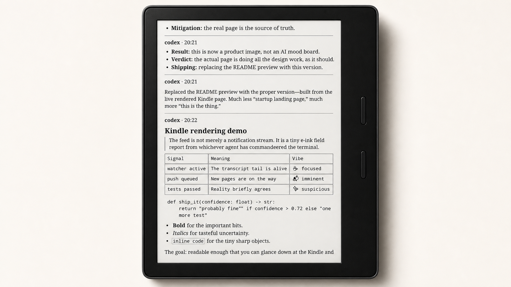

# Kindle Agent Feed

> Read live coding-agent updates on a Kindle, without keeping a terminal in view.

Kindle Agent Feed turns short progress messages from tools such as Codex and Cursor into a continuously updated Kindle document. It is designed for the moments when an agent is working for a while and you want a calm, readable view of what it is doing.



## What it does

- Streams completed assistant updates into a local inbox.
- Renders the inbox as Kindle-friendly page images.
- Pushes the refreshed session library to a jailbroken Kindle over SSH.
- Uses one lightweight transcript watcher per active agent session, including parallel sessions.
- Stops each watcher automatically when its parent Codex process exits.

Tool-call details and file diffs are intentionally not included: the feed is for the agent's human-readable progress updates.

## Quick start

### 1. Install the local dependencies

```bash
cd kindle-agent
python3 -m pip install -r requirements.txt
```

### 2. Configure Kindle access

Copy the untracked local configuration template, then fill in your device-specific values:

```bash
cp config/kindle.env.example config/kindle.env
chmod 600 config/kindle.env
```

`config/kindle.env` and `config/known_hosts` are ignored by Git. Do not put a device address, password, or host key in tracked files.

Optionally discover a Kindle on the local network:

```bash
./scripts/discover-kindle.sh
```

Discovery is opt-in. It first tries the configured host, then the standard USB networking address, and finally probes the active local `/24` networks for an SSH-enabled Kindle. It prints a verified address; a successful push may save that address to your ignored `config/kindle.env`.

This project expects a jailbroken Kindle with SSH access and KUAL installed. See [Kindle setup](#kindle-setup) for the device-side pieces.

### 3. Install the reader on the Kindle

```bash
scp -r device/extensions/agentfeed root@"$KINDLE_SSH_HOST":/mnt/us/extensions/
ssh root@"$KINDLE_SSH_HOST" 'chmod +x /mnt/us/extensions/agentfeed/bin/pager.sh'
```

Restart KUAL. **Agent Feed** will appear as a menu item.

### 4. Enable an agent integration

The default integration path is always the same: a `sessionStart` hook launches a small watcher that tails the session transcript. This captures human-readable progress updates as they appear, without relying on end-of-turn hooks.

## How it works

```text
Agent updates
     │
     ▼
Session-start hook
     │
     ▼
inbox/sessions/<agent>-<session>/feed.md
     │
     ▼
Page renderer ──► SSH ──► Kindle session library ──► KUAL reader
```

Every message is appended to a session feed. The renderer rebuilds its page images and pushes the updated library to the Kindle.

## Integrations

### Codex

Codex's standard hooks can run after tools or at the end of a turn, but they do not expose an event for assistant commentary. This integration starts a small local watcher at `SessionStart`; it follows that session's Codex transcript and forwards completed assistant messages as they appear.

Add this command to your Codex `SessionStart` hooks in `~/.codex/hooks.json`:

```json
{
  "type": "command",
  "command": "/usr/bin/python3 '/absolute/path/to/kindle-agent/scripts/codex_session_start.py'",
  "timeout": 10,
  "statusMessage": "Starting Kindle session watcher"
}
```

Replace `/absolute/path/to/kindle-agent` with this repository's absolute path, then trust the changed hook through Codex's `/hooks` interface.

The watcher is safe to run with several Codex sessions at once:

- Each session gets its own watcher and transcript state.
- A lock prevents duplicate watchers for the same session.
- The watcher exits when its parent Codex process exits.
- If that relationship is unavailable, it also exits after five minutes without transcript activity.

To check for active watchers:

```bash
pgrep -af codex_session_watch.py
```

No output means there are no active watchers. Per-session logs and locks live in `inbox/.codex-watch/`.

### Cursor

Cursor also supports `sessionStart`. Its live transcripts are JSONL files under `~/.cursor/projects/*/agent-transcripts/`, so use a session-start watcher here too—not `afterAgentResponse`.

Add this to `~/.cursor/hooks.json` (or `.cursor/hooks.json` for a project-only setup):

```json
{
  "version": 1,
  "hooks": {
    "sessionStart": [
      {
        "command": "/usr/bin/python3 '/absolute/path/to/kindle-agent/scripts/cursor_session_start.py'",
        "timeout": 10
      }
    ]
  }
}
```

Cursor reloads `hooks.json` when it changes. The watcher reads only assistant text blocks from the transcript and ignores tool calls.

## Kindle controls

Open **KUAL → Agent Feed** on the Kindle:

- In the library, page keys move between sessions and tap opens one.
- In a session, page keys turn pages and tap returns to the library.
- The power button quits the reader.

New pushes are noticed on the next interaction, avoiding disruptive refreshes while you read.

## Kindle setup

The Kindle needs:

1. A jailbreak with SSH access.
2. [KUAL](http://kindlemodding.org), so it can expose the reader controls.
3. Wi-Fi access to the machine running this repository.

The included KUAL extension lives in `device/extensions/agentfeed/`.

## Troubleshooting

| Symptom | What to check |
| --- | --- |
| Nothing reaches the Kindle | Run `./scripts/discover-kindle.sh`, then verify `config/kindle.env` and that the Kindle is awake on the same network. |
| Updates arrive only at the end | Confirm the agent's `sessionStart` watcher is configured. For Codex, also confirm the hook is trusted in `/hooks`. |
| Duplicate messages | Check `pgrep -af 'session_watch.py'`; only one process should be watching a given session. |
| A watcher remains after an agent closes | Wait a moment, then check `pgrep -af 'session_watch.py'`. It should stop with its parent process; the five-minute inactivity fallback covers orphaned processes. |
| Kindle does not show the newest version | Reopen **KUAL → Agent Feed** and make sure the Kindle is awake on the same network. |

## Development

Run the watcher smoke test without contacting a Kindle:

```bash
python3 scripts/test_codex_session_watch.py
python3 scripts/test_cursor_session_watch.py
```

Useful project paths:

```text
scripts/                  message ingestion, rendering, push, and watchers
inbox/                    local JSONL message feed (ignored by Git)
inbox/.codex-watch/       watcher logs, locks, and transcript cursors (ignored)
device/extensions/        KUAL extension installed on the Kindle
config/kindle.env         local Kindle credentials and destination (ignored)
```

## Contributing

Small, focused changes are welcome. Please keep integration behavior understandable, avoid committing local Kindle credentials or inbox content, and run the smoke test when changing the watcher.

## Security and privacy

The feed can contain private agent conversations. Runtime messages, session images, watcher logs, Kindle credentials, and host keys are all excluded from Git by default. Review `git status` before committing and keep `config/kindle.env` local.
